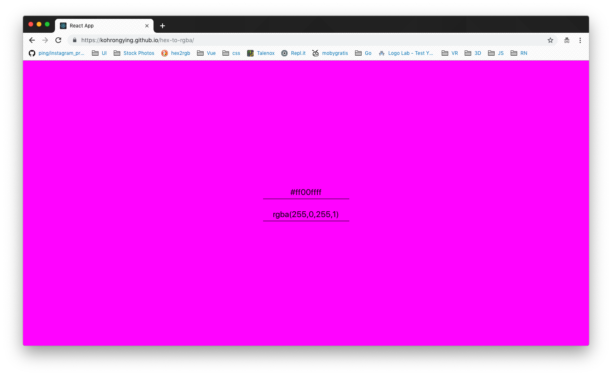

I found out color hex codes have transparency support in the last two digits out of the 8 digits. But I couldn't get the transparency to convert. 

So I built my own.

#### Converts Hex to RGBA and vice versa.
#### Show shades of colors related to the main.

