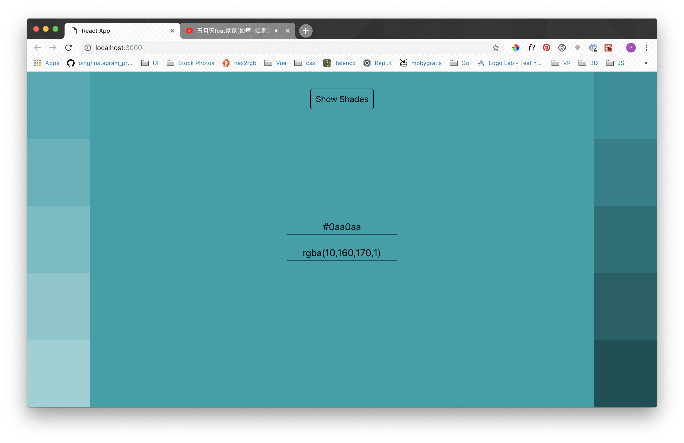
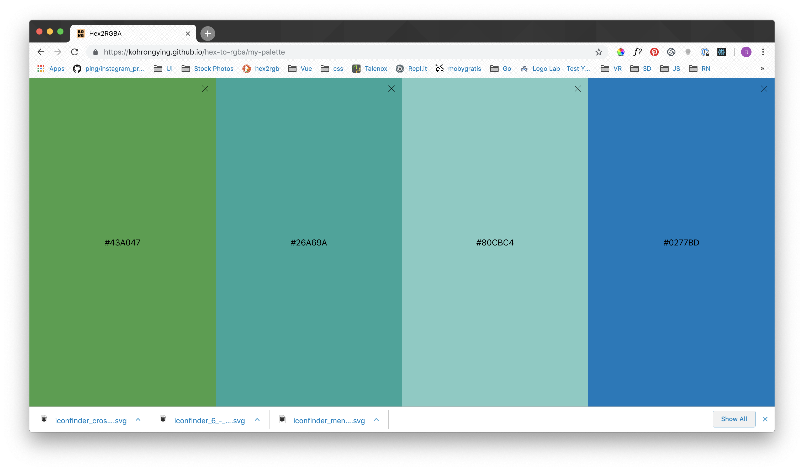

Get yourself some colors [here!](https://kohrongying.github.io/hex-to-rgba/)


I found out color hex codes have transparency support in the last two digits out of the 8 digits. But I couldn't get the transparency to convert. 

So I built my own.

#### Converts Hex to RGBA and vice versa.


#### Show shades of colors related to the main.



#### Shows collection of nice colors
Colors are stolen from [Material UI] (https://material-ui.com/style/color/#color)

Find a palette of nice material ui colors by appending the color behind the url. For example:
[https://kohrongying.github.io/hex-to-rgba/lightblue](https://kohrongying.github.io/hex-to-rgba/lightblue)


If you get lost, the 404 page will show a list of colors! 


#### Add color to custom palette


Under the main page or the palette pages, you're able to add the color to a custom palette. 



View / delete your palette!

### Deploy to GH Pages
```npm run deploy```